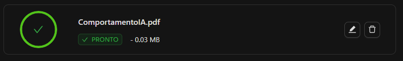

# Feedback Chatbot
## Proposta
Uma empresa do ramo alimentício (Alimentos SA) precisa de um chatbot capaz de receber feedback dos clientes, elogios ou reclamações e ser capaz de armazenar esses dados, nesse caso, em contadores na própria página. <br>
Para isso foi usado a API da Verbeux de IA generativa.

### Components
Um site com 2 componentes, Header e Body, sendo o primeiro apenas para estilo da página e o segundo é a parte principal que contém o chat. <br>

- Body
    - Possui 2 métodos:
        - createSession(): serve para fazer o método POST da API e criar a sessão e seus respectivos dados.
        - sendMessage(): responsável por enviar as mensagens do input do usuário para a API e receber a resposta da mesma e trabalhar em cima dos gatilhos.
    - HTML
        - Ele vai iterar sobre as menssagens enviadas pelo usuário e pelo bot e colocar os balões de chat.

### Services
Possui um service chamado ChatService:
- Faz as requisições HTTP: POST e PUT e então é injetado construtor do BodyComponent. 

### Bibliotecas
- Angular (com Angular Material e Tailwind para estilos)

### Documento de treinamento da IA
Escrevi um documento explicando o comportamento detalhado de como a IA deve se comportar e enviei para que ela fosse treinada.


### Como utilizar
1. Primeiro passo é clonar este repositório em sua máquina:
    ```git clone https://github.com/arturbartonelli/verbeux-feedback-chatbot.git```
2. Ao fazer o git clone, no terminal, utilize ```npm i``` para instalar todas as dependências do projeto
3. Em seguida, no terminal, digite  ```npm start```, para começar a rodar o projeto no link http://localhost:4200 por padrão.
4. No terminal deve-se receber "Sessão Criada!", mostrando que a conexão com a API foi bem sucedida.
5. Mande mensagens para o chatbot e ele reconhecerá e contará elogios e reclamações!

